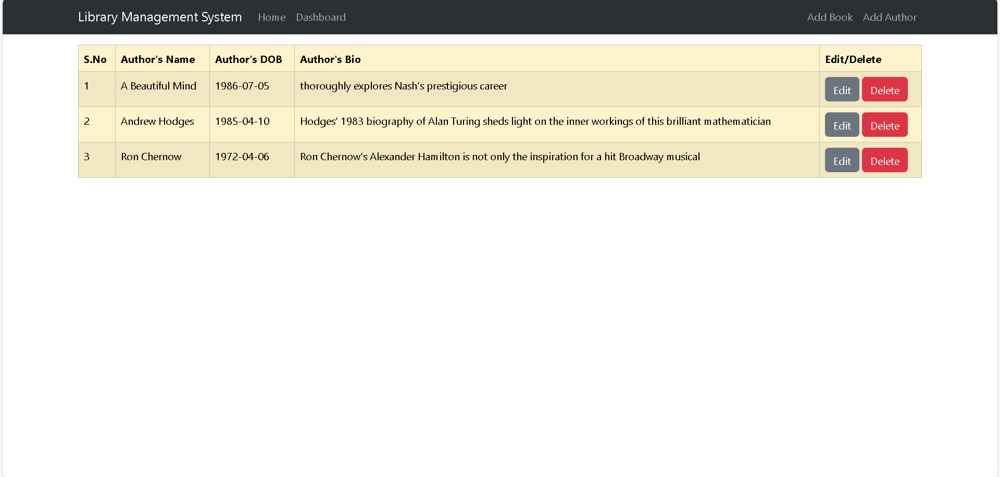
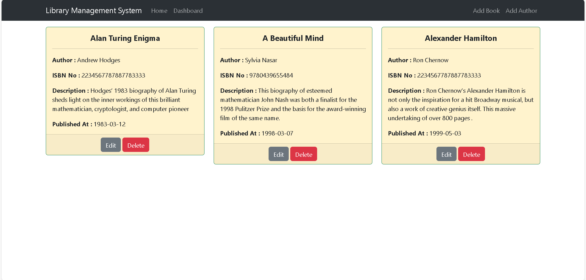

# 📚 Library Management System (Frontend)

A **React-based** Library Management System that provides an admin dashboard for efficiently managing books and authors. Built with **Formik & Yup** for robust form validation and a seamless UI.  

---
## 📖 Project Overview  

This system is designed for **library administrators** to manage books and authors easily. It allows CRUD (Create, Read, Update, Delete) operations on books and authors with a **user-friendly interface**. The application ensures data accuracy using **form validation** and maintains a responsive, modern design.  

### 🔹 Key Features  

✅ **📌 Admin Dashboard** – A structured UI for managing books & authors.  
✅ **📚 Books Management** – Add, edit, update, and delete books with details.  
✅ **🖋️ Authors Management** – View and manage author details efficiently.  
✅ **🔍 Dynamic Search & Filters** – Find books/authors quickly.  
✅ **⚡ Live Data Updates** – Reflects changes instantly without page reloads.  
✅ **✔️ Formik & Yup Validation** – Ensures proper data entry.  
✅ **🚀 Deployed on Vercel (Frontend) & Render (Backend)**  

---

## 📸 Screenshots  

📌 **Admin Dashboard**  
 

📌 **Home**  
  

---

## 🛠️ Tech Stack  

| **Technology** | **Description** |
|--------------|-------------|
| **React.js** | Frontend library for building UI |
| **Formik & Yup** | Form handling & validation |
| **Bootstrap / Tailwind CSS** | Styling for a modern UI |
| **LocalStorage / API** | Manages book & author data |
| **Vercel & Render** | Hosting & Deployment |

---

